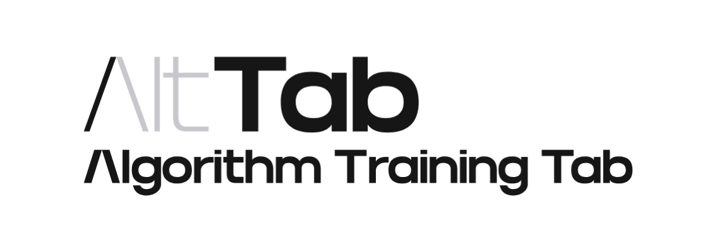

### ✨ 한 곳에서 해결하는 알고리즘 스터디! AltTab 📖

---

## 💬 서비스 소개

### ???????????

🌊 Naming : ???????????????

    ??????????????????.

---

## ⚙️ 주요 기능

<table>
	<tr >
		<td align="center">
		랜딩 페이지
		</td>
	</tr>
	<tr>
		<td align="center">
			
		</td>
	</tr>
</table>

|                                    <b>컴파일러 정답 화면</b>                                     |                                           <b>Draw</b>                                            |
| :----------------------------------------------------------------------------------------------: | :----------------------------------------------------------------------------------------------: |
|  |  |
|                                    <b>컴파일러 에러 화면</b>                                     |                                     <b>풀이 페이지 화면</b>                                      |
|  |  |

---

## 🖋 Service Architecture

	

## ⛓ Tech Stack

    <table border=""4>
        <th align="center">Role</th>
        <th style="text-align : center;" colspan="2">Framework</th>
        <!-- FrontEnd Stack -->
        <tr>
            <td rowspan="5" align="center"><b>FE</td>
            <td>&nbsp;&nbsp;<b>HTML</td>
            <td rowspan="3">Website Building Components</td>
        </tr>
        <tr>
            <td>&nbsp;&nbsp;<b>CSS</td>
        </tr>
        <tr>
            <td>&nbsp;&nbsp;<b>JavaScript</b></td>
        </tr>
        <tr>
            <td>&nbsp;&nbsp;<b>React</b></td>
            <td>Frontend Framework</tdi>
        </tr>
        <tr>
            <td>&nbsp;&nbsp;<b>TypeScript</b></td>
            <td>Frontend Programming Language</tdi>
        </tr>
        <!-- Backend Stack -->
        <tr>
            <td rowspan="6" align="center"><b>BE</td>
            <td>&nbsp;&nbsp;<b>Java21-Spring</td>
            <td rowspan="2">Spring Server Framework</td>
        </tr>
        <tr>
            <td>&nbsp;&nbsp;<b>Spring Boot</td>
            <tr>
            <td>&nbsp;&nbsp;<b>JPA & Data JPA</td>
            <td rowspan=1>Data Processing Skills</td>
        </tr>
        <tr>
            <td>&nbsp;&nbsp;<b>MySQL 8.0</td>
            <td>Back-End Main Database</td>
        </tr>     
        <tr>
            <td>&nbsp;&nbsp;<b>Mongo DB</td>
            <td>Back-End Main Database</td>
        </tr>   
        <tr>
            <td>&nbsp;&nbsp;<b>Redis</td>
            <td>Back-End Main Database</td>
        </tr>   
        <!-- Tools --> 
        <tr>
            <td rowspan="4" align="center"><b>Tools</td>
            <td>&nbsp;&nbsp;<b>Git</td>
            <td>Version Control System (VCS)</td>
        </tr>
        <tr>
            <td>&nbsp;&nbsp;<b>Notion</td>
            <td>Collaborative Productivity Platform</td>
        </tr>
        <tr>
            <td>&nbsp;&nbsp;<b>Google Slides</td>
            <td rowspan="2">Google Workspace Productivity Tools</td>
            <tr>
            <td>&nbsp;&nbsp;<b>Google Sheets</td>
        </tr>
    </table>

  

---

## 👥 Developers

 

    <table border=""6 width="50%">
        <tr>
            <th style="text-align : center;" colspan="2">FrontEnd</th>
            <th style="text-align : center;" colspan="3">Backend</th>
            <th style="text-align : center;" colspan="1">Infra</th>
        </tr>
        <tr>
            <td align="center"><a href="https://github.com/LEEJW1953"></td>
            <td align="center"><a href="https://github.com/Jaeyoung9999"></td>
            <td align="center"><a href="https://github.com/noxknow"></td>
            <td align="center"><a href="https://github.com/jijongkwon"></td>
            <td align="center"><a href="https://github.com/yootal"></td>
            <td align="center"><a href="https://github.com/ssh2957"></td>
        </tr>
        <tr>
            <td align="center"><a href="https://github.com/LEEJW1953">이지원</td>
            <td align="center"><a href="https://github.com/Jaeyoung9999">이재영</td>
            <td align="center"><a href="https://github.com/noxknow">이치왕</td>
            <td align="center"><a href="https://github.com/jijongkwon">지종권</td>
            <td align="center"><a href="https://github.com/yootal">유경헌</td>
            <td align="center"><a href="https://github.com/ssh2957">신승호</td>
        </tr>
    </table>

